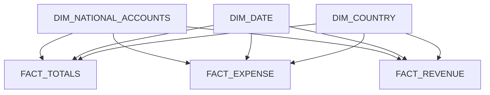

## 🌟 Introduction

Welcome to our collaborative project space where **Charlotte** and **Jan** build insightful **Power BI Dashboards**. Our journey begins with extracting publicly available data, primarily from **Eurostat** and other reliable sources. Utilizing a custom **Python API**, we efficiently upload this data into our **PostgreSQL database**. The heart of our work lies in constructing robust data models, facilitated by **dbt**, to power our Power BI visualizations.

## 📊 Case Studies

Explore our diverse case studies, each offering unique insights and implications. This is still a work in progress!

### 💼 Government Expenses

#### Overview
This report examines the variation in government spending patterns across different sectors and regions in the EU. It's based on data from Eurostat: [🔗 Source](https://ec.europa.eu/eurostat/databrowser/view/gov_10a_main/default/table?lang=en). The data encompasses five key columns: 'Geopolitical reporting entity', 'Time', 'Unit of measure', 'Sector', and 'National accounts indicator (ESA 2010)'. Each column is briefly explained below, with a detailed description available [here](https://ec.europa.eu/eurostat/cache/metadata/en/gov_10a_main_esms.htm).

##### Geopolitical Reporting Entity
- Involves EU and euro area countries, Iceland, Norway, and Switzerland.

##### Time
- The time period is measured in years.

##### Unit of Measure
- Data are presented in millions of Euro, millions of national currency units, and percentages of GDP.

##### Sector
- Refers to the general government sector as defined in ESA2010.

##### National Accounts Indicator (ESA 2010)
- National accounts as defined in ESA2010.

**Elaboration on 'Sector' and 'National Accounts Indicator':**
The 'Sector' column includes data for the general government as well as its subsectors. In contrast, the 'National Accounts Indicator' column comprises various granularities, like 'Expense', 'Revenue', 'Net Lending/Borrowing', and their respective subcategories.

#### One Big Table
Here's an example table illustrating the initial dataset structure:

| Value | National Accounts Indicator (ESA 2010) | Category |
|-------|---------------------------------------|----------|
| 1     | Expense                               | Total    |
| 2     | Revenue                               | Total    |
| 3     | Net Borrowing/Lending                 | Total    |
| 1     | Compensation of employees, payable    | Expense  |
| 2     | Subsidies, payable                    | Expense  |
| 3     | Interest, payable                     | Expense  |

*Note: The table is truncated for brevity. Please refer to the source for complete data.*

#### Simplified Tables for Clarity
To simplify, we divide the data into tables based on granularity:

##### Expense-Revenue-Fact-Table
| Value | National Accounts Indicator (ESA 2010) | Category |
|-------|---------------------------------------|----------|
| 1     | Expense                               | Total    |
| 2     | Revenue                               | Total    |
| 3     | Net Borrowing/Lending                 | Total    |

##### Expense-Fact-Table
| Value | National Accounts Indicator (ESA 2010) | Category |
|-------|---------------------------------------|----------|
| 1     | Compensation of employees, payable    | Expense  |
| 2     | Subsidies, payable                    | Expense  |
| 3     | Interest, payable                     | Expense  |

##### Revenue-Fact-Table
| Value | National Accounts Indicator (ESA 2010) | Category |
|-------|---------------------------------------|----------|
| 1     | Taxes on production and imports       | Revenue  |
| 2     | Current taxes on income, wealth, etc. | Revenue  |
| 3     | Net social contributions, receivable  | Revenue  |

*Tables are illustrative and truncated for simplicity.*

#### Data Model

#### Findings
...

#### Conclusion
...

[🔗 View Government Expenses Report](https://app.powerbi.com/view?r=eyJrIjoiZjU2Y2VjZDktNmUyNC00NjFiLWFkNzYtYmE1YTU0NmY1MGQ1IiwidCI6IjI5ODAzN2JlLTdhZDgtNGM4My04MGYzLTRmMDQ1NGEwY2ZjZCJ9)

### 👥 Demographics

#### Overview
A comprehensive examination of demographic shifts and trends within the European Union.

#### Data Model
...

#### Findings
...

#### Conclusion
...

[🔗 View Demographics Report](https://link-to-demographics-report)

### 💔 Divorce Rate

#### Overview
Studying the changing patterns of divorce rates across the EU, and the underlying factors.

#### Data Model
...

#### Findings
...

#### Conclusion
...

[🔗 View Divorce Rate Report](https://link-to-divorce-rate-report)

## 🚀 Getting Started

To delve into our data and analysis, explore the Power BI dashboards linked above. The datasets and scripts used in these studies are also available in this repository.

### 📁 Repository Structure

- `Power BI/`: Contains Power BI reports and datasets for each case study.
- `etl/`: Hosts ETL scripts, dbt project for data transformation, and README for setup and usage instructions.

### 🛠 Data Models and Environments

We have developed three data models based on Eurostat data: one focused on government expenses, one on self-employment, and one on marriages and divorces. The data is ingested into a locally hosted PostgreSQL database using Python scripts. We have set up four distinct databases for different stages of development:

1. **DEV**: The developer works exclusively with the DEV database. All columns containing non-KPI values are encrypted, and the dataset is limited to 1 million rows per use case.
2. **TEST**: In the TEST database, the full date range is available, with some columns (such as KPI indicators) decrypted.
3. **PRODUCTION**: The PROD database contains all data with all columns decrypted except for those containing geo-data.
4. **DEPLOYMENT**: The DEPLOYMENT database holds the final version, where all data and columns are fully decrypted.

Given that Row-Level-Security (RLS) and Object-Level-Security (OLS) primarily concern data consumption, and considering that developers can still access all data, we emphasize the development of semantic models over RLS or OLS. This approach ensures that sensitive data is protected during development and testing phases.

### 📦 Automation with Power BI Deployment Pipelines

Automation is achieved using Power BI

 Deployment Pipelines:

- **DEV Workspace**: Developers have access only to the DEV workspace. Uploading data to DEV triggers a pipeline that automatically pushes the data through TEST, PROD, and DEPLOYMENT environments.
- **Approval Workflow**: Once the pipeline is functional, approval steps will be implemented to ensure that each stage is reached only after passing quality checks.

This workflow helps us maintain data security and integrity while ensuring a seamless development and deployment process.
